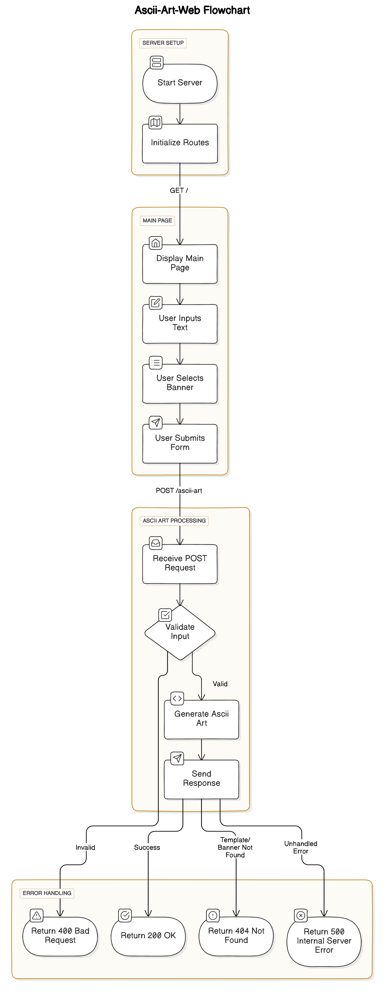

# ASCII Art Web

## Overview
ASCII Art Web is a web-based application that allows users to convert text into ASCII art. This project supports multiple fonts and styles, enabling users to create unique and creative ASCII representations of their input text. The project includes predefined ASCII art fonts like "shadow", "Thinkertoy" and "Standard", among others, providing a variety of artistic styles for text transformation.

## Features
- **Multiple Fonts**: Choose from a variety of fonts including "Thinkertoy" and "Standard" to stylize your text.
- **Web Interface**: A user-friendly web interface that makes it easy to input text and see the ASCII art output.


## Getting Started
To get started with ASCII Art Web, follow these steps:

1. Clone the repository to your local machine.
2. Navigate to the project directory.
3. Run the web server (details on how to run the server should be provided here).
4. Open your web browser and go to the URL of the running web server.
5. Enter the text you want to convert into ASCII art and select your preferred font and settings.
6. Enjoy your ASCII art output!

## Authors
- **Yassine Rahhaoui** - [GitHub](https://github.com/yassinerahhaui)
- **Ilyass Atlassi** - [GitHub](https://github.com/ilyassatlassi)

## Usage: How to Run
To run the ASCII Art Web application locally, follow these steps:

1. **Clone the Repository:**
   ```sh
   git clone https://github.com/les-iriss/ascii-art-web.git
   cd ascii-art-web
   ```
2. **Run Command:**
    ```
    go run .
    ```

## 📊 Diagram
